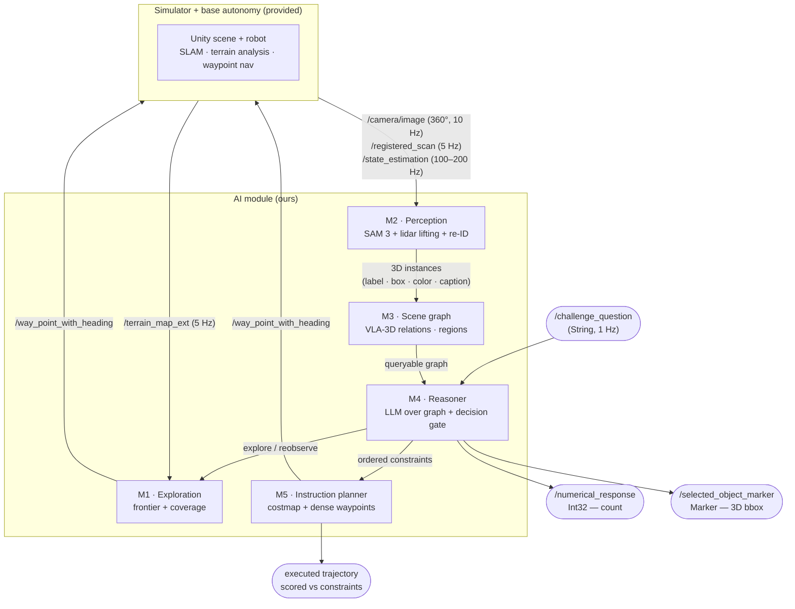

# CMU VLN Challenge 2026 — Team Plan

Daily work lives in the **private** repo `SaiSugunSegu/cmu-vln-2026` (`origin`); the public fork is used only at submission time (see CONTRIBUTING.md remotes table). Our code goes in `ai_module/`; our planning docs live in `docs/`, `experiments/`, `scripts/`, and this file.

IROS 2026 · Simulation phase · [Challenge site](https://www.ai-meets-autonomy.com/cmu-vln-challenge) · [Challenge repo](https://github.com/Yuxin916/CMU-VLA-Challenge-2026)

## Quickstart (replicate the infra)

Hardware target: x86_64 Ubuntu 24.04 + NVIDIA GPU (our dev box: i9-13900, 64 GB, L4 24 GB). Full runbook with every command: **[docs/M0_infra.md](docs/M0_infra.md)**.

```bash
# 1. Docker + NVIDIA container toolkit (see docs/M0_infra.md §setup)
# 2. Clone challenge code (submodules!)
git clone --recurse-submodules git@github.com:Yuxin916/CMU-VLN-Challenge-2026.git
# 3. Start containers
cd CMU-VLN-Challenge-2026/docker && xhost + && docker compose -f compose_gpu.yml up --build -d
# 4. Sim (terminal A)
docker exec -it iros2026_system bash -c "/home/docker/autonomy_stack_mecanum_wheel_platform/system_simulation.sh"
# 5. Dummy VLM (terminal B)
docker exec -it iros2026_ai_module bash -c "ros2 launch dummy_vlm dummy_vlm.launch"
# 6. Ask a question (terminal C)
docker exec -it iros2026_ai_module bash -c "ros2 topic pub --once /challenge_question std_msgs/msg/String \"{data: 'How many books are on the sofa'}\""
```

## Repo layout

```
TEAM_PLAN.md              ← you are here: plan, milestones, decisions
ai_module/                ← OUR CODE — the only folder evaluated at submission
docs/                     ← one doc per component: task, plan, checklist, log
  M0_infra.md ... M6_eval_harness.md
experiments/              ← one md per experiment run (see TEMPLATE.md)
scripts/                  ← helper scripts (bag record, question pub, eval runs)
(everything else)         ← upstream challenge code — do not modify
```

Rules for keeping this fork submission-ready: never modify upstream files (README, autonomy stack, docker) so `git merge upstream/main` stays clean; our additions live only in the folders above. Before submission, ask organizers (GitHub issue) whether extra docs folders are acceptable or should be stripped to a clean branch.

## Key dates
| Date | Milestone |
|---|---|
| **Jul 25, 2026 (Sat)** | Registration deadline — DO THIS FIRST |
| Aug 25, 2026 | Submission deadline (multiple submissions allowed, best kept) |

## Scoring (per question, 5 questions × 3 test scenes)
- Numerical: /1 (exact Int32) · Object reference: /2 (bbox overlap) · Instruction following: /6 (trajectory constraint order + penalties)
- 10 min/question incl. exploration. System relaunches per question — no memory carries over. Early finish = tiebreaker bonus.

## Architecture



**Simulator + base autonomy (provided)** — we never touch this.
- In: `Pose2D` waypoints. Out: 360° camera, registered lidar (map frame), terrain maps, odometry.
- Handles SLAM, obstacle avoidance, low-level path following.

**M1 · Exploration** — see every object fast.
- In: `/terrain_map_ext`, odometry, requests from M4. Out: waypoints to base autonomy.
- Frontier-based coverage sweep; doorway detection for multi-room; `reobserve(id)` viewpoints on demand; early stop when M4 is confident (time bonus).

**M2 · Perception** — pixels + points → labeled 3D object instances.
- In: 360° images, registered scans, odometry. Out: instance stream (label, 3D box, color, caption, embedding).
- SAM 3 text-prompted masks + track IDs → project lidar through masks → depth-cluster → box; SigLIP 2 re-ID merges revisited objects (dedup = correct counts); Qwen2.5-VL captions per instance.

**M3 · Scene graph** — instances → queryable spatial facts.
- In: instance stream. Out: query API (`filter(label, color, relation, anchor)`).
- VLA-3D's exact 8 relation heuristics (Above/Below/Closest/Farthest/Between/Near/In/On) — the same functions that generated the questions; regions from object clusters.

**M4 · Reasoner** — owns the question from parse to answer.
- In: `/challenge_question`, graph queries. Out: `Int32` count / `Marker` bbox / constraint spec to M5; explore-reobserve requests to M1.
- LLM parses question → symbolic graph queries; decision gate (confident? explore more? T-30s fallback → always answer something).

**M5 · Instruction planner** — "go near X, avoid Y, stop at Z" → trajectory.
- In: ordered constraints (grounded objects) from M4, terrain map. Out: dense waypoint sequence.
- Costmap with attraction/avoid zones; waypoints every ~1 m so the base planner can't shortcut through forbidden areas; monitors execution, replans on violation.

**M6 · Eval bench** (offline, `scripts/eval/`) — runs all 15 scenes × 5 questions, scores like the challenge; every change is measured before merge.

## Component docs

**Start here → [docs/ARCHITECTURE.md](docs/ARCHITECTURE.md)** — end-to-end baseline, per-component proposals (baseline → top candidate), diagrams, weekly plan, risks.
| Doc | Component | Owner | Status |
|---|---|---|---|
| [docs/M0_infra.md](docs/M0_infra.md) | Docker, sim, ROS I/O, visualization | | 🟡 in progress |
| [docs/M1_exploration.md](docs/M1_exploration.md) | Frontier exploration, viewpoints, stopping | | ⚪ not started |
| [docs/M2_perception.md](docs/M2_perception.md) | Open-vocab detection → 3D instances | | ⚪ not started |
| [docs/M3_scene_graph.md](docs/M3_scene_graph.md) | Spatial relations, queryable store | | ⚪ not started |
| [docs/M4_reasoner.md](docs/M4_reasoner.md) | Question parsing, grounding, decision gate | | ⚪ not started |
| [docs/M5_instruction_planner.md](docs/M5_instruction_planner.md) | Constraint-ordered waypoint plans | | ⚪ not started |
| [docs/M6_eval_harness.md](docs/M6_eval_harness.md) | Auto-scoring on 75 training questions | | ⚪ not started |

Status legend: ⚪ not started · 🟡 in progress · 🟢 baseline done · 🔵 upgrade done · ✅ frozen for submission

## Weekly milestones
| Week | Theme | Modules | Exit criteria |
|---|---|---|---|
| W1 Jul 21–27 | It runs | M0, M1 base, M6 skeleton, M2 bake-off | Sim explores room <3 min; perception model chosen w/ latency numbers |
| W2 Jul 28–Aug 3 | It sees | M2, M3 base | ≥80% instance recall, <10% duplicates on 4 scenes |
| W3 Aug 4–10 | It answers | M4 | ≥70% numerical + object-ref on training Qs |
| W4 Aug 11–17 | It follows | M5, M6 trajectory scorer | Positive scores on majority of instruction Qs |
| W5 Aug 18–25 | It survives | Hardening, timing, fallbacks | First submission ~Aug 20; iterate to Aug 25 |

## Standing rules
1. Always emit an answer before timeout (T-30s fallback) — partial credit is free points.
2. No model choice locked without a latest-version check (SAM 3 not SAM 2, SigLIP 2 not CLIP, etc.). Re-check in W4 before freeze.
3. Final Docker image must be **linux/amd64** (eval NUC is x86_64) — the L4 box builds this natively. See M0 doc.
4. Every change is measured by M6 before merging — every experiment gets an entry in `experiments/`.
5. Docs are updated in the same PR as the code they describe.

## Decision log
| Date | Decision | Why |
|---|---|---|
| Jul 21 | Modular pipeline over end-to-end VLA | Waypoint interface + exact counting favor symbolic graph answers |
| Jul 21 | SAM 3 primary perception candidate | Single model: open-vocab detect + segment + track |
| Jul 21 | L4 box (i9-13900 + L4 24GB) as the sole dev machine, single-box | x86_64 like eval NUC, same i9-13900 CPU class, Ubuntu 24.04, GUI for RViz — mirrors eval exactly |
| | | |
