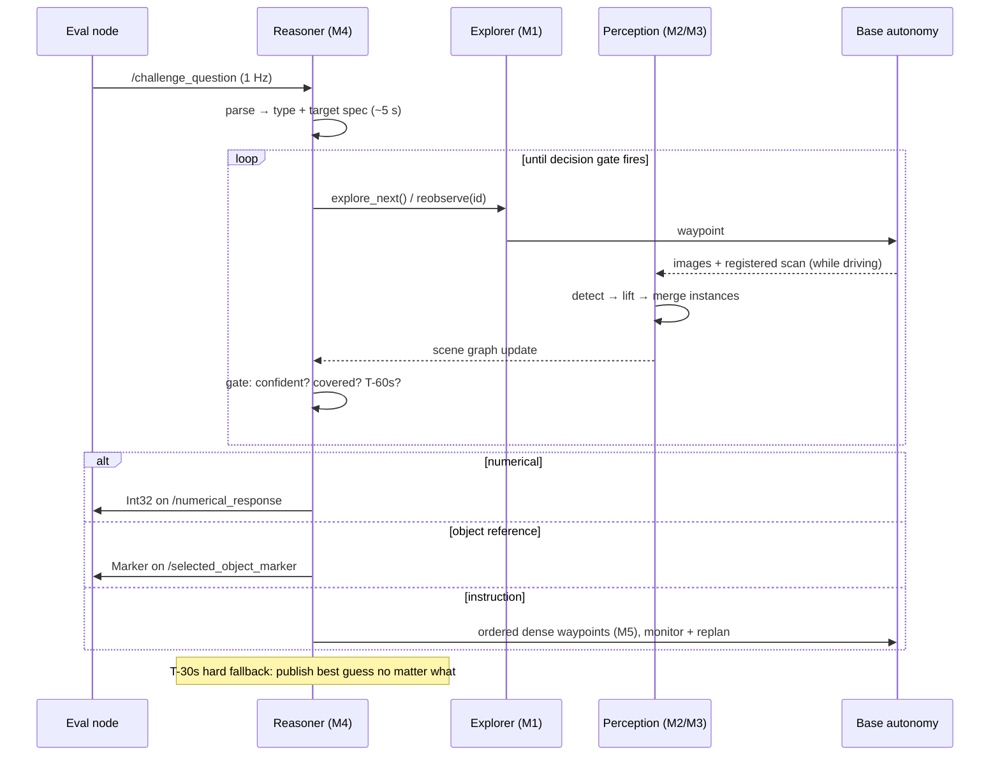

# Architecture & Proposals — CMU VLN 2026

Design doc: end-to-end baseline, per-component proposals (baseline → top candidate), and the weekly plan.
Research-backed; sources at the bottom. Companion trackers: `M0…M6` in this folder.

---

## 1. Design principles

1. **Walking skeleton first.** A complete, scoring pipeline by end of W2 — weak everywhere, broken nowhere. Every upgrade then replaces one box at a time, measured by M6.
2. **Answers come from a structured scene graph, not pixels.** Counting = counting graph nodes; grounding = symbolic filtering. This is exactly the zero-shot approach the organizers themselves published (SORT3D) and the direction 2025-26 grounding SOTA converged on (SceneGraphGrounder, View-on-Graph).
3. **Points-per-effort ordering.** Instruction-following = 6/9 pts per question mix → gets the most iteration. Numerical = 1 pt but binary → cheap wins from dedup quality.
4. **Every question must produce an answer** (T-30s fallback). Partial credit on object-ref/instruction is free.
5. **10-min clock is a feature:** early finish = tiebreaker bonus → early-stopping logic is a scoring component, not an optimization.

---

## 2. System overview

Component-level block diagram + per-component summaries: **[main README](../README.md#architecture)**. Below: the runtime behavior that diagram doesn't show.

### Runtime sequence (one question, 10-min budget)

---

## 3. End-to-end baseline (walking skeleton — done by end of W2)

The simplest complete system that scores non-zero on all three question types. Everything local except two LLM calls.

| Stage | Baseline implementation | Est. effort |
|---|---|---|
| Question parsing | One API-LLM call → JSON `{type, targets[], attributes{}, relations[], order[]}` | 0.5 d |
| Exploration | Occupancy grid from `/terrain_map_ext`; nearest-frontier; stop at 90% coverage or 5 min | 2 d |
| Perception | YOLOE (prompted with VLA-3D vocab + question nouns) on 4×100° crops @ 1 Hz; lidar points inside box → median-depth cluster → AABB; merge by centroid dist < 0.5 m + same label | 3 d |
| Attributes | Median HSV of box interior → nearest color word; size = bbox volume | 0.5 d |
| Scene graph | Flat instance list JSON (no relation precompute — LLM gets raw centroids and reasons directly) | 0.5 d |
| Answering | One API-LLM call with instance JSON → count / pick instance / order constraint objects | 1 d |
| Instruction path | One waypoint at each ordered constraint object (offset 1 m toward free space), then goal; publish on arrival radius 0.5 m | 1 d |
| Fallbacks | T-30s: publish count=modal class count, marker=best label match, waypoint=goal object | 0.5 d |

Expected baseline scoring (against 75 training Qs): numerical ~50-60% (dedup errors), object-ref partial overlap on most, instruction partial credit from order-correct waypoints without avoid-zone handling. That's a mid-table 2025 result — from there, targeted upgrades.

---

## 4. Per-component proposals: baseline → top candidate

### M1 Exploration — DECIDED Jul 22, see [M1 doc](M1_exploration.md)
| | Choice | Why / research |
|---|---|---|
| **Decided** | **TARE (vendored) + supervisor node** owning clock, question-conditioned stopping, waypoint mux, object-coverage done-signal | TARE pre-integrated in organizer's stack; supervisor holds all scoring logic |
| Upgrade | Question-biased visit order: VLFM-style SigLIP frontier scoring + lidar doorway detection (multi-room) | [VLFM](https://arxiv.org/pdf/2312.03275), [LGR](https://arxiv.org/pdf/2503.20241), [LLM-MCoX](https://arxiv.org/html/2509.26324v1) |
| Fallback | Sparse viewpoint sweep (360° camera → ~4 m observed disk per pose, mini-TSP) | If TARE vendoring/build fights us |

### M2 Perception
| | Choice | Why / research |
|---|---|---|
| Baseline | YOLOE (real-time open-vocab, prompt = vocab list) + box-interior lidar lifting | Fast, simple, runs anywhere ([YOLOE](https://learnopencv.com/yoloe-tutorial-real-time-open-vocabulary-detection/)) |
| **Top candidate** | **SAM 3** promptable concept segmentation: text-phrase → all instance masks + built-in tracking (one model replaces detect+segment+associate); mask-based lidar lifting w/ depth clustering; **SigLIP 2** crop embeddings for cross-view re-ID; VLM-on-best-crop for hard attributes | [SAM 3](https://github.com/facebookresearch/sam3) (2× prior SOTA on concept segmentation, 30 ms/frame on H200), [SigLIP 2](https://arxiv.org/abs/2502.14786) (better localization/dense features than CLIP/SigLIP) |
| Fallback | Grounding DINO 1.6 + MobileSAM | If SAM 3 too slow on NUC-class GPU (check distilled/edge variants first) |

### M3 Scene graph
| | Choice | Why / research |
|---|---|---|
| Baseline | Flat instance JSON, LLM reasons over raw centroids | Zero code, works for small scenes |
| **Top candidate** | **VLA-3D's 8 relation heuristics ported verbatim** (Above/Below/Closest/Farthest/Between/Near/In/On — the exact functions that generated the questions) + SORT3D toolbox for LLM sequencing; VLA-3D 15-color LAB mapping for attributes; validate by diffing our relations vs shipped `_scene_graph.json` | [SORT3D](https://arxiv.org/abs/2504.18684) — CMU's own zero-shot system; **SORT3D-Nav `humble-mecanum` branch runs on our same autonomy stack with a semantic mapping module + Qwen2.5-VL captioner (10 GB VRAM) — study/adapt before writing anything** ([repo](https://github.com/nzantout/SORT3D)); [VLA-3D format](https://github.com/HaochenZ11/VLA-3D) |
| Fallback | Subset of relations (near, closest) hand-written | Relations are unit-testable in isolation |

### M4 Reasoner
| | Choice | Why / research |
|---|---|---|
| Baseline | Single LLM call: question + instance JSON → answer | One prompt, surprisingly strong with good perception |
| **Top candidate** | **Tool-calling agent**: `query_graph` (SORT3D filters), `reobserve(id)`, `verify_crop(id, question)` (VLM check on stored crop), `answer()`; SceneGraphGrounder-style query-graph→subgraph matching for complex references; calibrated decision gate (confidence τ + margin δ + coverage); provider fallback + cached parses | [SceneGraphGrounder](https://arxiv.org/html/2605.21788), [View-on-Graph](https://arxiv.org/abs/2512.09215) (zero-shot 3DVG SOTA '26), [SPAZER](https://arxiv.org/pdf/2506.21924) (agentic spatial reasoning) |
| Fallback | Local Qwen-class LLM for parse + rules for counting | Removes network dependency for 2 of 3 question types |

### M5 Instruction planner
| | Choice | Why / research |
|---|---|---|
| Baseline | One waypoint per ordered constraint + goal | Earns order-based partial credit immediately |
| **Top candidate** | **Costmap + dense trajectory**: attraction bands near pass-constraints, inflated repulsion polygons for avoid-zones, waypoints every ~1 m so base planner can't shortcut through forbidden space; execution monitor (odometry vs plan) with replan-on-violation; pre-execution self-scoring against our own M6 trajectory scorer | [Beyond Waypoints](https://arxiv.org/pdf/2606.07244) (trajectory-centric waypointing), [NavOne](https://arxiv.org/pdf/2605.06317) (global top-down-map planning); scoring rules: order sacred, penalties for forbidden areas |
| Fallback | Denser sampling along straight-line homotopy avoiding zones | If costmap tuning runs out of time |

### M6 Eval harness (not optional — the compass)
| | Choice |
|---|---|
| Baseline | Runner over 75 training Qs; exact-match + IoU scorers; results table per run |
| **Top candidate** | + Own trajectory scorer replicating constraint-order/penalty logic vs provided `.ply` GT; per-module metrics (recall, dupes, grounding acc on GT objects vs live); 10-question smoke set for fast iteration; nightly full run |

---

## 5. Weekly plan

Maintained in one place: **[TEAM_PLAN.md](../TEAM_PLAN.md#weekly-milestones)**.

---

## 6. Top risks & mitigations

| Risk | Mitigation |
|---|---|
| SAM 3/YOLOE weak on Unity synthetic textures | W1 bake-off catches it; fine-tune on training-scene renders w/ VLA-3D labels |
| Duplicate instances wreck counting | Re-ID stress test on identical-furniture scene in M6; SAM 3 tracking; obs_count≥2 rule |
| API outage/latency at eval | Cached parses, retries, second provider, local-LLM fallback for parse+count |
| Trajectory scoring semantics guessed wrong | Build our scorer W4 vs provided `.ply` GT; ask organizers via GitHub issue early |
| Eval GPU weaker than L4 | Keep 2× latency headroom; SAM 3 edge/distilled variants pre-tested |
| 10-min timeout on multi-room scenes | Doorway-aware exploration; budget manager: hard answer-mode at T-60s |

---

## Sources

[SORT3D](https://arxiv.org/abs/2504.18684) · [SORT3D code](https://github.com/nzantout/SORT3D) · [SAM 3](https://github.com/facebookresearch/sam3) · [SigLIP 2](https://arxiv.org/abs/2502.14786) · [YOLOE](https://learnopencv.com/yoloe-tutorial-real-time-open-vocabulary-detection/) · [VLFM](https://arxiv.org/pdf/2312.03275) · [LGR](https://arxiv.org/pdf/2503.20241) · [LLM-MCoX](https://arxiv.org/html/2509.26324v1) · [SceneGraphGrounder](https://arxiv.org/html/2605.21788) · [View-on-Graph](https://arxiv.org/abs/2512.09215) · [SPAZER](https://arxiv.org/pdf/2506.21924) · [Beyond Waypoints](https://arxiv.org/pdf/2606.07244) · [NavOne](https://arxiv.org/pdf/2605.06317) · [Org thesis (object-centric grounding)](https://www.ri.cmu.edu/app/uploads/2025/09/HaochenZhang_MSR_Thesis.pdf) · [Challenge repo](https://github.com/Yuxin916/CMU-VLA-Challenge-2026) · [2025 3rd-place note (CMU MRSD)](https://labs.ri.cmu.edu/mrsd-news/articles/)
