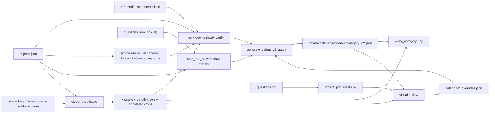

# Category-2 (object reference) benchmark

Ground truth for **object reference**: up to 10 questions per scene, each naming exactly one
object, whose answer is that object's 3D box. 122 questions across the 13 scenes that ship
referential statements.

Two commands, both host-side, both a few seconds:

```bash
just gen-cat2       # write data/benchmark/<scene>/category_2/<scene>_category2_qa.json
just verify-cat2    # re-derive every answer from the metadata; non-zero exit on any mismatch
```

Unlike category 1, **there is no cache to build** — no SAM, no VLM, no bag replay. The
ground truth is a join over data already on disk, so regenerating the whole benchmark is
cheap, and regenerating is the *only* supported way to change it: hand edits to the QA
files are overwritten by the next `gen-cat2`. Corrections go in
[`bags/category2_overrides.json`](../bags/category2_overrides.json).

One input is not on disk to begin with: **which objects the robot's camera actually saw**.
That is measured from the bags by `just visibility`, which is the one step in this loop that
needs ros2 and a GPU-free container pass over the recordings, and whose committed report
keeps everything else host-only. See [the visibility gate](#the-visibility-gate).

## Where it comes from

```
bags/<scene>/iref_vla_metadata/<scene>_referential_statements.json   utterance -> target, relation, anchors
bags/<scene>/iref_vla_metadata/<scene>_objects.json                  object_id -> 8-corner bbox, centre, size, colours
bags/<scene>/<scene>_0.mcap                                          the robot's camera, lidar and odometry
questions/questions.json                                             the official questions, as text
questions/<scene>/questions.pdf                                      the screenshot each official question ships with
```



| File | Role |
|---|---|
| [`bags/cat2_geometry.py`](../bags/cat2_geometry.py) | boxes, distance metrics, spatial predicates — one definition of "closest" for all three consumers |
| [`bags/cat2_text_solver.py`](../bags/cat2_text_solver.py) | parses an official question into head noun + relation hops and resolves it against the boxes |
| [`scripts/eval/object_visibility.py`](../scripts/eval/object_visibility.py) | `just visibility` — projects every box into the robot's own camera frames and measures what it resolved |
| [`bags/cat2_visibility.py`](../bags/cat2_visibility.py) | reads those reports; the gate the generator and verifier both apply |
| [`bags/generate_category2_qa.py`](../bags/generate_category2_qa.py) | mines candidates from the statements, synthesises the rest from the boxes, applies overrides, selects 10 per scene, writes the QA file |
| [`scripts/eval/verify_category2.py`](../scripts/eval/verify_category2.py) | independent audit: reloads the metadata and re-checks every claim |
| [`bags/extract_pdf_assets.py`](../bags/extract_pdf_assets.py) | `just pdf-assets` — dumps the PDF screenshots into `data/pdf_assets/` (untracked) |

`bags/` is otherwise gitignored, since it holds the recorded scenes and their metadata. These
scripts and `category2_overrides.json` are negated back in: without them the benchmark cannot
be regenerated, and the overrides file is the record of the review pass. The QA JSON under
`data/benchmark/` is tracked; `data/pdf_assets/` is not — rebuild it with `just pdf-assets`.

## The visibility gate

IRef-VLA is annotated from the Unity model, not from the robot, and the two disagree about
what exists. The metadata has recessed downlights a camera 0.85 m off the floor passes
underneath, a book that covers 270 px² of a 1920×640 panorama, and the far side of walls.
A question about one of those has a perfectly good 3D answer and no way to earn it from the
sensors, which measures the benchmark rather than the system.

So it is measured. `just visibility` (≈35 s/scene, in the ai_module container because it
needs ros2 and the bag) walks every lidar frame of `bags/<scene>`, and for each frame:

1. gathers the sweeps in the **mapper's own fusion window** (0.5 s before, 0.1 s after — one
   Mid-360 sweep is 10.6k points over the whole sphere, so judging a 5°-wide object on a
   single sweep measures the sensor's sparsity, not what the robot saw);
2. projects them with the **deployed** camera model — `sam_mapper.cloud_image_fusion`, the
   same 1920×640 equirect mapping and the same extrinsics the mapper uses, so "visible" means
   visible to the pipeline as configured rather than to an idealised pinhole camera;
3. counts the returns that fall inside an object's box **and** land inside the image.

That last test covers both failure modes at once. Geometry the camera cannot reach drops out
because its rows project outside the 120° band; geometry the camera cannot see through drops
out because the lidar never returned from it — an occluder stops both beams.

An object is **visible** when some frame gives it ≥ 12 such returns, ≥ 900 px² of apparent
size, and ≤ 0.60 foreground occlusion. Every rejection carries its reason, and the reasons are
the point:

| reason | what it is | example |
|---|---|---|
| `too_small` | in frame, but too few pixels to ground | `book#10`, 270 px² at 2.1 m; twelve `focus light`s |
| `never_scanned` | no returns off its surface in any frame | glass panes (the beam passes through), a wall the path never faced |
| `occluded` | mostly foreground in front of it | `pillow#7` behind a sofa back, 0.75 |
| `outside_camera_band` | scanned, but every return projects above or below the image | ceiling fixtures the robot drives under |
| `out_of_range` | never within 15 m of the robot | — |

Two measurement details matter. Apparent size is taken from the **box's own projected
corners**, not from the returns: returns are sparse and, with any box slack at all, partly
belong to whatever the object is flush against, which made a book on a table as big as the
table. And a return may sit 10 cm outside a box and still count as a hit, because IRef boxes
are tight and a picture hanging flush on a wall otherwise reads as `never_scanned`.

The verdicts are reviewable rather than assertions: every accepted object is written out as an
annotated crop of the frame it was best seen in (`data/crops/visibility/<scene>/`, untracked),
`--views-all` adds the rejects as `rejected_<reason>_<id>_<class>.png`, and the thresholds above
were set by looking at them. At the 900 px² boundary a potted plant is a recognisable green
patch and a book is a yellow sliver. The flag changes only which PNGs are written, never the
report, so two runs of the recipe below produce byte-identical committed JSON.

What it cannot see is contrast: the measurement says the sensors reached an object, not that
anything in the image distinguishes it from the surface it lies on. Reviewing the crops of the
122 shipped questions turned up exactly one such case, and it is handled by a `hide` override
[below](#the-review-loop).

```bash
just visibility                      # all 13 scenes (~8 min), copies reports into data/benchmark/
just visibility arabic_room "--views-all"
just gen-cat2 && just verify-cat2    # the gate is only as fresh as the last report
```

The reports are committed under `data/benchmark/<scene>/visibility/`, which is what keeps
`gen-cat2` runnable from a fresh clone with no bags. If a report is missing, the gate is
**inactive** and both `gen-cat2` and `verify-cat2` say so loudly — un-measured is not the same
as invisible, and silently emptying the benchmark would be worse than passing everything.

**Visibility is a property of the recording, not of the room.** `loft` has 75 lidar frames
(~10 s of driving) against `livingroom_4`'s 509, and only 39 of its 101 objects were ever
resolved. That is the right notion for this benchmark — the map is built from these same bags
— but it means a longer recording of a scene raises its question count, and the honest
response to a thin scene is a longer bag, not a lower threshold.

What it cost, applied to the corpus that existed before it: **47 of 130 questions named an
object the robot never resolved** — 42 generated ones, now gone, and 5 official ones, which
are kept (below).

| scene | objects visible | | scene | objects visible |
|---|---|---|---|---|
| `arabic_room` | 55 / 81 | | `livingroom_3` | 79 / 106 |
| `chinese_room` | 60 / 93 | | `livingroom_4` | 94 / 116 |
| `hotel_room_1` | 65 / 74 | | `loft` | 39 / 101 |
| `hotel_room_2` | 43 / 80 | | `office_1` | 73 / 111 |
| `japanese_room` | 52 / 59 | | `office_2` | 72 / 115 |
| `livingroom_1` | 81 / 103 | | `studio` | 42 / 61 |
| `livingroom_2` | 62 / 86 | | **total** | **817 / 1186** |

Rivals are deliberately **not** filtered by visibility. An unseen twin still makes "the vase
closest to the sofa" ambiguous in the room the question is asked about, so uniqueness is
checked against every object in the region and only targets and anchors have to be visible.

## The join is not enough

IRef-VLA emits every statement its grammar allows, including ones no human could resolve —
"the pillow closest to the plant" in a room with three plants. `arabic_room` alone has 1155
statements, of which 88 survive. A candidate is kept only if **all** of these hold, all
re-derived from the boxes rather than trusted from the statement:

| Rule | Why |
|---|---|
| the answer wins by **≥ 0.30 m** under *both* centre-to-centre *and* box-gap distance | the two metrics disagree whenever a large object is involved, and the grader's is unpublished |
| unique under *both* the raw IRef label *and* the coarser NYU label | uniqueness over raw labels alone passes "the table closest to the sofa" in a room that also holds a "tea table" |
| the anchor is the only object of its class in its region | an ambiguous anchor makes the question ambiguous however clean the target geometry is |
| **≥ 1 same-class competitor** | with no rival the relation is decoration: "the shower tap on the shower" is answered by "the shower tap" |
| the question, read back by the solver, still names that one object **scene-wide** | verification is per region, but the robot is asked the question in the whole house — see below |
| the target **and every anchor** were resolved by the robot's camera | [the visibility gate](#the-visibility-gate): a box the sensors never saw is not a question |
| no structural answer (`wall`, `floor`, `door`, `column`, `stairs`, `focus light`, …) | nothing to point at, or twenty identical downlights that no image-space grounding can separate |
| nothing from `BAD_LANDMARKS` as an anchor (cables, cameras) | a cable's box is a long diagonal that runs past half the table; "closest to the camera" reads as the robot's own |

and, for the relations that are not distance comparisons, also:

| Rule | Why |
|---|---|
| the anchor does not rest on the target, or vice versa | "closest to the book" when the book sits *on* the target is a riddle: the distance is zero either way |
| no room-sized anchor (`floor`, `ceiling`, `tatami`; also `carpet` for `on`/`above`/`below`/`between`) | "farthest from the tatami" is not a question — the tatami is the whole floor |
| no room-sized *target* for `in`/`above`/`below`/`between` | everything in the room is above the carpet, so it separates no carpet from any other |
| no structural anchor for `on`/`in`/`supports`/`above`/`below` | a wall's box is the room's perimeter, so it "supports" and sits "above" everything inside it |
| for `above`/`below`, the anchor is at least 0.3× the target's volume | it is the whole difference between "the picture above the suitcase" and "the window above the book" — same footprints, same clearance, and only the sizes say which one a person says |
| for `above`/`below`, no third object stacked between the two | the flowers stand in a vase on the ledge, so "the flowers above the ledge" is true and nobody says it — the vase is right there to name |

Colour is never used to rescue an ambiguous anchor. The palette comes from clustering mesh
vertex colours, so "the purple potted plant" can disagree with what a person sees. It is
used only to *read* an official question, and then through a small alias table, because
every pillow in `japanese_room` is stored `maroon` while the official question calls one red.

What each relation means, once: `near` is absolute rather than comparative — the target
within 1.50 m, every same-class competitor beyond 2.50 m. `between` needs the target inside
the middle 15–85 % of the anchor-anchor segment, within a lateral corridor of 35 % of their
separation capped at 1 m, with the anchors at most 4.5 m apart and 3 m from the target:
uncapped, two door frames and four windows make four different wall lamps "between a door
frame and a window", and two anchors across the room make "the table between the shoes and
the jar" geometrically perfect nonsense. `on` is support — the bigger footprint underneath,
with the item's base at least 30 % of the way up the support's height, because a bed's box is
1.74 m tall thanks to the headboard and the pillow on it sits nowhere near the top.
`supports` is that read backwards ("the table **with** the coffee pot on it"), and `in` is
containment rather than support: the inner object's base 10 cm below the outer's rim, in an
outer at least 15 cm deep, so a 2 cm tray holds things *on* it and never *in* it.

## Most relations are not in the statements

IRef's grammar wrote 16330 `near` statements for these scenes and 155 `on` ones. That ratio
is a property of the generator that produced them, not of the rooms: every scene is full of
objects resting on, over, under and between other objects. Mining alone therefore yields a
benchmark that is three quarters distance comparisons — 98 of 130 in the first cut, with
three `below` questions in the whole suite.

So the spatial predicates are **synthesised from the boxes** as well as mined: for every
(target, uniquely-named anchor) pair in a region, `on`, `supports`, `in`, `above`, `below`
and `between` are each tested directly. A synthesised candidate goes through exactly the same
verification and askability rules as a mined one — an utterance earns no credit for having
been written down — and carries `derivation: "geometry"` with an empty `statement`, against
`derivation: "statement"` for the mined ones. Comparatives are never synthesised: IRef
already emits thousands, and every same-class pair in the room generates another.

`between` is quadratic in the anchors and a room yields hundreds of true betweenness claims,
so only the two tightest per target are kept, ranked by lateral offset over anchor separation.

## Up to ten slots, spread on purpose

Ranking candidates by how unmistakable they are also produces ten distance comparisons: a
"farthest from" across a room wins every margin contest a support relation can enter. So each
relation gets a quota, spent scarcest-first (`between`, `in`, `supports`, `above`, `below`,
`on`, `near`, `closest`, `farthest`), and the official questions' relations count against it —
a scene whose two official questions are both `closest` does not then pick two more. Quotas
are raised a step at a time to top a scene up to ten, in the *opposite* order: a leftover slot
belongs to a relation with hundreds of candidates, whose second-best is still excellent,
rather than to one that had two. Two rules never relax: one question per target object, and
one per (target class, anchor) pair — "closest to X" and "farthest from X" over the same class
each give away the other's answer.

Among candidates that are equally unmistakable on the geometry, the one the robot saw best
wins — bucketed by 500 px², so a marginal difference in apparent size cannot reorder the pool
and the selection stays reproducible.

The last gate before a candidate takes a slot is the text solver: the question is read back
and has to resolve to that same object across the whole scene. This is what catches "the
curtains closest to the trash bin" in `hotel_room_1`, whose bathroom has a shower curtain and
a bin of its own — verification is per region, and a region is one room of a house the robot
walks through. Five candidates were dropped this way; all 96 generated questions in the suite
re-solve from their own text.

Three scenes now come in under ten: `arabic_room` at 6, `livingroom_2` and `loft` at 8.
`arabic_room` is the clearest case — it is a room whose landmarks are tabletop objects (book,
tray, coffee pot, jar, shoes), all of them `too_small` from the floor, and what is left is
banks of identical pillows and downlights that no phrase separates. Nine candidates survive in
the whole scene. Padding those scenes would mean lowering a threshold that the crops say is
already at the limit of what can be grounded, so they stay short and say why.

## Official questions are solved, not matched

The organizers give the official questions as text only, so their answer object has to be
recovered. String-matching them against the generated utterances does not work: "the wall
lamp that is between a door frame and a window" has no generated counterpart in
`arabic_room`, and the nearest string is a *farthest-from* statement about a different lamp.

So `cat2_text_solver` parses the question and solves it geometrically:

```
Find the pillow closest to the book on the stool.
  head: pillow   hops: [(closest, book), (on, stool)]
```

Hops collapse right to left — find the book on the stool, then the pillow closest to it —
and every step lands in `solver_trace` on the question, so an answer can be argued with. It
returns "ambiguous, and here is the tie" rather than a guess: a question resolving in two
regions of a two-room scene is ambiguous by construction and is reported as such.

Five of the 26 official questions do not resolve, and their answer is **pinned by hand** in
the overrides file after reading the PDF screenshot — which outlines the expected object —
against `<scene>_objects.json`. The reasons are worth knowing, because they are the shape of
the problem rather than solver bugs: the anchor is not in the metadata at all
(`chinese_room`'s folding screen, `japanese_room`'s sushi, which is on a dish), the winner is
inside the 0.30 m margin because the candidates are 0.70 m apart (`loft`'s blue chairs), or
centre distance ties an anchor against its twin in the other region of a two-room scene
(`livingroom_2`, `office_2`). Each pin carries its note.

All 26 official questions are kept **including the eight whose own object the robot never
resolved** — `livingroom_1`'s vase is 6 cm of pixels, `studio`'s target sits behind
foreground, `loft`'s three anchors are in the part of the loft that 10 s of driving never
reached. Those are the organizers' questions; the benchmark's job is to record the problem,
not to edit it away, so each carries a `visibility_warning` naming the object and the reason,
and `gen-cat2` prints them. Expect them to score zero however good the reasoner is: that is a
fact about the recording, and the fix is a longer bag.

Nothing else is dropped by hand: the two `hotel_room_2`
drops that the review pass once carried — questions anchored on "the camera", a 13 cm photo
camera in the metadata — became a rule instead, since the reason generalises. `BAD_LANDMARKS`
in `cat2_geometry` is where that judgement lives now.

## The review loop

```bash
just visibility                     # only when the bags or the camera model change
just pdf-assets                     # data/pdf_assets/<scene>/*.png + pdf_text.json
$EDITOR bags/category2_overrides.json
just gen-cat2 && just verify-cat2
```

Two kinds of picture are involved and they answer different questions. The PDF screenshot
shows what the *organizers* meant by an official question. The visibility crop
(`views[].image` on every question) shows what the *robot* saw of that object, and is the one
to open when asking whether a question is answerable at all.

Overrides are keyed by scene, then by question text:

| Key | Effect |
|---|---|
| `pin` | text → `object_id`: this is the answer, the solver could not get there |
| `reword` | old text → new text, applied after selection |
| `drop` | question text to remove, official or generated; drops happen *before* selection, so the scene still lands on 10 |
| `hide` | `object_id` → why: overrules the visibility report for one object, which is then neither target nor anchor anywhere in the scene |
| `note` | free text recorded on the question as `review_note` — why the override exists |

`hide` exists because the gate has one blind spot: it measures whether the *sensors reached*
an object, not whether anything in the image tells it apart from what it lies on.
`livingroom_3`'s `vase#40` is a 15 cm flat object on a coffee table's lower shelf — the lidar
returns from that volume as strongly as from anywhere (and for a flat object in a shelf, the
shelf's own returns fall inside its box), while the frame shows a black recess with nothing in
it. Whether that counts as seen is a judgement, not a measurement, and this is where judgement
belongs. It is keyed by object rather than by question text on purpose: dropping the phrasing
only brings the same object back as "the vase below the flower".

Today: 5 pins, each explained by a note, and 1 hide. When a correction's reason generalises —
"a photo camera is a confusing landmark", "a wall is a room-sized datum" — it belongs in
`cat2_geometry` as a rule, not in one scene's override list.

`gen-cat2` prints any rule that matched nothing this run, which is how the file stays honest:
after a threshold moves, a correction whose question the generator no longer produces still
reads like a live decision while doing nothing. A `hide` is reported stale once the
measurement rejects that object on its own, and a `note` attached to a dropped question is
never stale — its question is gone because the rule worked, and the explanation is the point.

## The QA file

```json
{
  "id": "Q03",
  "question": "Find the vase that is closest to the shoes.",
  "source": "generated",
  "derivation": "statement",
  "difficulty": "easy",
  "relation": "closest",
  "target_objects": ["vase", "shoes"],
  "answer": {
    "object_id": "24", "label": "vase", "region": "0",
    "center": [-1.3602, -2.2491, 0.2802], "size": [0.3491, 0.3442, 0.5599], "yaw": 0.5236,
    "aabb": {"min": [-1.5974, -2.4854, 0.0002], "max": [-1.1229, -2.0127, 0.5602]},
    "size_aabb": [0.4745, 0.4727, 0.5599],
    "bbox_corners": ["... 8 corners ..."],
    "volume": 0.0673, "colors": ["gray", "navy", "purple"]
  },
  "anchors": [{"object_id": "1", "label": "shoes", "phrase": "the shoes"}],
  "distractor_ids": ["42"],
  "competitors": 1,
  "margin": 5.901,
  "evidence": "closest: centre 2.08 m vs runner-up vase#42 8.00 m; box-gap 1.58 m vs runner-up vase#42 7.48 m",
  "statement": "the vase that is closest to the shoe",
  "views": [
    {"object_id": "24", "role": "target", "frames_visible": 41, "distance_m": 1.62,
     "px_area": 7644, "occlusion": 0.0, "elevation_deg": -8.9, "stamp": 1785527063.72,
     "image": "data/crops/visibility/arabic_room/24_vase.png"}
  ],
  "verified": true
}
```

`center + size + yaw` is the oriented box; `aabb + size_aabb` is the axis-aligned
equivalent for a scorer that ignores orientation — [`scripts/eval/score.py`](../scripts/eval/score.py)
reads centre and size. **Answer with a `CUBE` marker, never the RViz wireframe**: see the
structural-zero guard in [`map3d_bench.md`](map3d_bench.md#the-category-2-marker-score).

`margin` appears only on the comparative relations (`closest`, `farthest`, `near`), because
it is a distance in metres and there is no such number for `on` or `between`; `competitors`
— how many same-class rivals the relation ruled out — is what carries for those.
`derivation` says where a generated question came from: `statement` for a mined IRef
utterance (which is then quoted in `statement`), `geometry` for one synthesised from the
boxes. `target_objects` are bare nouns with colour adjectives stripped, so they can feed SAM
prompts directly. Official questions additionally carry `solver_trace` and `images`
(the PDF screenshot the question ships with).

`views` records, per object the question names, the frame the robot saw it best in — how many
frames it was visible in at all, how far away, how many pixels, how much foreground was in
front of it, and the annotated crop to look at. A `visibility_warning` instead of a `views`
entry means the robot never resolved that object; only official questions can carry one.

Difficulty: **easy** = one competitor and a uniquely named anchor; **medium** = 2–3
competitors, a vertical or containment relation, or a single-hop official question; **hard**
= 4+ competitors, a `between`, or a multi-hop official question.

## Current corpus

122 questions: 26 official, 67 mined from statements, 29 synthesised from geometry;
32 easy / 55 medium / 35 hard.

| relation | closest | farthest | between | near | on | supports | above | in | below |
|---|---|---|---|---|---|---|---|---|---|
| count | 29 | 28 | 15 | 14 | 13 | 9 | 6 | 5 | 3 |

Distance comparisons are 71 of the 122, down from 98 of 130 before the predicates were
synthesised. Every scene carries at least five distinct relations.

Scenes: `arabic_room` (6), `livingroom_2` (8), `loft` (8) and ten each for `chinese_room`,
`hotel_room_1/2`, `japanese_room`, `livingroom_1`, `livingroom_3/4`, `office_1/2`, `studio` —
the three short ones are what [the visibility gate](#the-visibility-gate) leaves them.
`home_building_1/2` have no referential statements; `office_building_1/2` are the held-out
test scenes.

## What the verifier catches

`verify-cat2` reloads the metadata from scratch — it never trusts a number in the QA file —
and fails on: an `answer.object_id` that no longer exists, any geometry field that disagrees
with the metadata, a structural answer, an anchor that is missing or is the answer itself, a
relation that no longer holds uniquely, a relation that holds but is unaskable under the rules
above, a generated question whose answer or anchor the robot's camera never resolved, a
`margin` or `competitors` that no longer recomputes, **any** question whose text no longer
resolves to its own answer and is not pinned, duplicate ids, a missing visibility report, an
empty scene, and any scene holding *more* than the expected question count. A scene with
*fewer* is a warning that prints the shortfall and the scene's visible-object count, because
after the gate that is the expected state for three scenes and a gate nobody can run green is
a gate nobody runs. It is safe to gate on: currently **122 verified, 0 failed, 3 warnings**.

The text check runs on generated questions as well as official ones, which makes the QA file
self-consistent rather than merely internally consistent: the question as written, read by the
solver, picks out the stored answer and nothing else in the scene.

Run it after `gen-cat2` and after any metadata refresh. It is the thing that stops a
metadata change from quietly shipping a wrong ground-truth box.

## Where it is consumed

[`scripts/eval/score_map3d.py`](../scripts/eval/score_map3d.py) `question_target_ids()`
reads these `answer.object_id`s as the question-target set, which is what
`recall_question_targets` and the category-2 marker score are computed over. Category 1's
`object_ids` are only the fallback for scenes with no category-2 file: a counting question
touches many objects and singles out none, so it over-counts targets.

That scorer then intersects targets with the *askable* set — GT whose label is in the scene's
SAM 3 prompt set — and only about two thirds of the answers survive it (**81 of the 122** by
the label matching `gen-cat2` uses; `just map3d-score` reports its own figure through the
scorer's prompt→GT-label map). The prompt sets in
`data/benchmark/bench_prompts.json` are curated from the five official questions per scene and
capped at 10, while a generated question names whatever the scene contains, so `books`,
`ceiling lamp`, `towel rack` and `tv remote` are targets nobody prompted. That is a gap in the
prompt sets, not in the benchmark: the fix is to widen them (SAM 3 time per scene is why they
are capped), never to restrict category-2 selection to classes we already prompt.

## Deliberately out of scope

No reasoner. This produces the benchmark JSON and its verifier; picking the right object at
run time is M4's job, and the marker score in `map3d_bench.md` is measured with **oracle**
selection until it exists.
