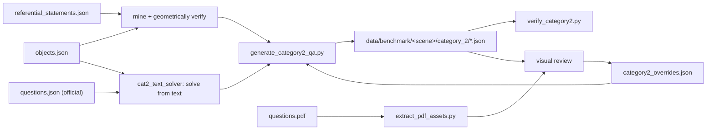

# Category-2 (object reference) benchmark

Ground truth for **object reference**: 10 questions per scene, each naming exactly one
object, whose answer is that object's 3D box. 130 questions across the 13 scenes that ship
referential statements.

Two commands, both host-side, both a few seconds:

```bash
just gen-cat2       # write data/benchmark/<scene>/category_2/<scene>_category2_qa.json
just verify-cat2    # re-derive every answer from the metadata; non-zero exit on any mismatch
```

Unlike category 1, **there is no cache to build** — no SAM, no VLM, no bag replay. The
ground truth is a join over data already on disk, so regenerating the whole benchmark is
cheap, and regenerating is the *only* supported way to change it: hand edits to the QA
files are overwritten by the next `gen-cat2`. Corrections go in
[`bags/category2_overrides.json`](../bags/category2_overrides.json).

## Where it comes from

```
bags/<scene>/iref_vla_metadata/<scene>_referential_statements.json   utterance -> target, relation, anchors
bags/<scene>/iref_vla_metadata/<scene>_objects.json                  object_id -> 8-corner bbox, centre, size, colours
questions/questions.json                                             the official questions, as text
questions/<scene>/questions.pdf                                      the screenshot each official question ships with
```



| File | Role |
|---|---|
| [`bags/cat2_geometry.py`](../bags/cat2_geometry.py) | boxes, distance metrics, spatial predicates — one definition of "closest" for all three consumers |
| [`bags/cat2_text_solver.py`](../bags/cat2_text_solver.py) | parses an official question into head noun + relation hops and resolves it against the boxes |
| [`bags/generate_category2_qa.py`](../bags/generate_category2_qa.py) | mines candidates, applies overrides, selects 10 per scene, writes the QA file |
| [`scripts/eval/verify_category2.py`](../scripts/eval/verify_category2.py) | independent audit: reloads the metadata and re-checks every claim |
| [`bags/extract_pdf_assets.py`](../bags/extract_pdf_assets.py) | `just pdf-assets` — dumps the PDF screenshots into `data/pdf_assets/` (untracked) |

`bags/` is otherwise gitignored, since it holds the recorded scenes and their metadata. These
scripts and `category2_overrides.json` are negated back in: without them the benchmark cannot
be regenerated, and the overrides file is the record of the review pass. The QA JSON under
`data/benchmark/` is tracked; `data/pdf_assets/` is not — rebuild it with `just pdf-assets`.

## The join is not enough

IRef-VLA emits every statement its grammar allows, including ones no human could resolve —
"the pillow closest to the plant" in a room with three plants. `arabic_room` alone has 1155
statements, of which 104 survive. A candidate is kept only if **all** of these hold, all
re-derived from the boxes rather than trusted from the statement:

| Rule | Why |
|---|---|
| the answer wins by **≥ 0.30 m** under *both* centre-to-centre *and* box-gap distance | the two metrics disagree whenever a large object is involved, and the grader's is unpublished |
| unique under *both* the raw IRef label *and* the coarser NYU label | uniqueness over raw labels alone passes "the table closest to the sofa" in a room that also holds a "tea table" |
| the anchor is the only object of its class in its region | an ambiguous anchor makes the question ambiguous however clean the target geometry is |
| **≥ 1 same-class competitor** | with no rival the relation is decoration: "the shower tap on the shower" is answered by "the shower tap" |
| the anchor does not rest on the target, or vice versa | "closest to the book" when the book sits *on* the target is a riddle: the distance is zero either way |
| no structural answer (`wall`, `floor`, `door frame`, `focus light`, …) | nothing to point at, or twenty identical downlights that no image-space grounding can separate |
| no room-sized anchor (`floor`, `ceiling`, `tatami`; also `carpet` for above/below) | "farthest from the tatami" is not a question — the tatami is the whole floor |

Colour is never used to rescue an ambiguous anchor. The palette comes from clustering mesh
vertex colours, so "the purple potted plant" can disagree with what a person sees. It is
used only to *read* an official question, and then through a small alias table, because
every pillow in `japanese_room` is stored `maroon` while the official question calls one red.

`near` is absolute rather than comparative: the target within 1.50 m, every same-class
competitor beyond 2.50 m. `between` requires the target inside the middle 15–85 % of the
anchor-anchor segment, within a lateral corridor of 35 % of their separation capped at 1 m —
uncapped, two door frames and four windows make four different wall lamps "between a door
frame and a window".

Selection then spreads the 10 slots over relations, target classes and anchors, relaxing the
caps in later passes for scenes whose statements are too thin to fill ten at the strict
limits. Two rules never relax: one question per target object, and one per (target class,
anchor) pair — "closest to X" and "farthest from X" over the same class each give away the
other's answer.

## Official questions are solved, not matched

The organizers give the official questions as text only, so their answer object has to be
recovered. String-matching them against the generated utterances does not work: "the wall
lamp that is between a door frame and a window" has no generated counterpart in
`arabic_room`, and the nearest string is a *farthest-from* statement about a different lamp.

So `cat2_text_solver` parses the question and solves it geometrically:

```
Find the pillow closest to the book on the stool.
  head: pillow   hops: [(closest, book), (on, stool)]
```

Hops collapse right to left — find the book on the stool, then the pillow closest to it —
and every step lands in `solver_trace` on the question, so an answer can be argued with. It
returns "ambiguous, and here is the tie" rather than a guess: a question resolving in two
regions of a two-room scene is ambiguous by construction and is reported as such.

Five of the 26 official questions do not resolve, and their answer is **pinned by hand** in
the overrides file after reading the PDF screenshot — which outlines the expected object —
against `<scene>_objects.json`. The reasons are worth knowing, because they are the shape of
the problem rather than solver bugs: the anchor is not in the metadata at all
(`chinese_room`'s folding screen, `japanese_room`'s sushi, which is on a dish), the winner is
inside the 0.30 m margin because the candidates are 0.70 m apart (`loft`'s blue chairs), or
centre distance ties an anchor against its twin in the other region of a two-room scene
(`livingroom_2`, `office_2`). Each pin carries its note.

All 26 official questions are kept. The drops so far are two *generated* candidates in
`hotel_room_2`, both anchored on "the camera" — a 13 cm photo camera in the metadata, which
reads as the robot's own in a robot benchmark. Other candidates backfill the scene to 10.

## The review loop

```bash
just pdf-assets                     # data/pdf_assets/<scene>/*.png + pdf_text.json
$EDITOR bags/category2_overrides.json
just gen-cat2 && just verify-cat2
```

Overrides are keyed by scene, then by question text:

| Key | Effect |
|---|---|
| `pin` | text → `object_id`: this is the answer, the solver could not get there |
| `reword` | old text → new text, applied after selection |
| `drop` | question text to remove, official or generated; drops happen *before* selection, so the scene still lands on 10 |
| `note` | free text recorded on the question as `review_note` — why the override exists |

Today: 5 pins, 2 drops and 1 reword, each explained by a note in the file.

## The QA file

```json
{
  "id": "Q03",
  "question": "Find the vase that is closest to the shoes.",
  "source": "generated",
  "difficulty": "easy",
  "relation": "closest",
  "target_objects": ["vase", "shoes"],
  "answer": {
    "object_id": "24", "label": "vase", "region": "0",
    "center": [-1.3602, -2.2491, 0.2802], "size": [0.3491, 0.3442, 0.5599], "yaw": 0.5236,
    "aabb": {"min": [-1.5974, -2.4854, 0.0002], "max": [-1.1229, -2.0127, 0.5602]},
    "size_aabb": [0.4745, 0.4727, 0.5599],
    "bbox_corners": ["... 8 corners ..."],
    "volume": 0.0673, "colors": ["gray", "navy", "purple"]
  },
  "anchors": [{"object_id": "1", "label": "shoes", "phrase": "the shoes"}],
  "distractor_ids": ["42"],
  "competitors": 1,
  "margin": 5.901,
  "evidence": "closest: centre 2.08 m vs runner-up vase#42 8.00 m; box-gap 1.58 m vs runner-up vase#42 7.48 m",
  "statement": "the vase that is closest to the shoe",
  "verified": true
}
```

`center + size + yaw` is the oriented box; `aabb + size_aabb` is the axis-aligned
equivalent for a scorer that ignores orientation — [`scripts/eval/score.py`](../scripts/eval/score.py)
reads centre and size. **Answer with a `CUBE` marker, never the RViz wireframe**: see the
structural-zero guard in [`map3d_bench.md`](map3d_bench.md#the-category-2-marker-score).

`margin` appears only on the comparative relations (`closest`, `farthest`, `near`), because
it is a distance in metres and there is no such number for `on` or `between`; `competitors`
— how many same-class rivals the relation ruled out — is what carries for those.
`target_objects` are bare nouns with colour adjectives stripped, so they can feed SAM
prompts directly. Official questions additionally carry `solver_trace` and `images`
(the PDF screenshot the question ships with).

Difficulty: **easy** = one competitor and a uniquely named anchor; **medium** = 2–3
competitors, a vertical relation, or a single-hop official question; **hard** = 4+
competitors, a `between`, or a multi-hop official question.

## Current corpus

130 questions, 26 official / 104 generated; 50 easy / 45 medium / 35 hard.

| relation | closest | farthest | near | on | between | above | below |
|---|---|---|---|---|---|---|---|
| count | 38 | 34 | 26 | 17 | 7 | 5 | 3 |

Scenes: `arabic_room`, `chinese_room`, `hotel_room_1/2`, `japanese_room`,
`livingroom_1..4`, `loft`, `office_1/2`, `studio` — 10 each. `home_building_1/2` have no
referential statements; `office_building_1/2` are the held-out test scenes.

## What the verifier catches

`verify-cat2` reloads the metadata from scratch — it never trusts a number in the QA file —
and fails on: an `answer.object_id` that no longer exists, any geometry field that disagrees
with the metadata, a structural answer, an anchor that is missing or is the answer itself, a
relation that no longer holds uniquely, a `margin` or `competitors` that no longer recomputes,
an official question whose text now resolves elsewhere and is not pinned, duplicate ids, and
any scene that is not at 10 questions. It is safe to gate on: currently **130 verified, 0
failed**.

Run it after `gen-cat2` and after any metadata refresh. It is the thing that stops a
metadata change from quietly shipping a wrong ground-truth box.

## Where it is consumed

[`scripts/eval/score_map3d.py`](../scripts/eval/score_map3d.py) `question_target_ids()`
reads these `answer.object_id`s as the question-target set, which is what
`recall_question_targets` and the category-2 marker score are computed over. Category 1's
`object_ids` are only the fallback for scenes with no category-2 file: a counting question
touches many objects and singles out none, so it over-counts targets.

That scorer then intersects targets with the *askable* set — GT whose label is in the scene's
SAM 3 prompt set — and only **69 of the 130** answers survive it. The prompt sets in
`data/benchmark/bench_prompts.json` are curated from the five official questions per scene and
capped at 10, while a generated question names whatever the referential statements name, so
`door`, `column`, `towel rack` and `tv remote` are targets nobody prompted. That is a gap in
the prompt sets, not in the benchmark: the fix is to widen them (SAM 3 time per scene is why
they are capped), never to restrict category-2 selection to classes we already prompt.

## Deliberately out of scope

No reasoner. This produces the benchmark JSON and its verifier; picking the right object at
run time is M4's job, and the marker score in `map3d_bench.md` is measured with **oracle**
selection until it exists.
